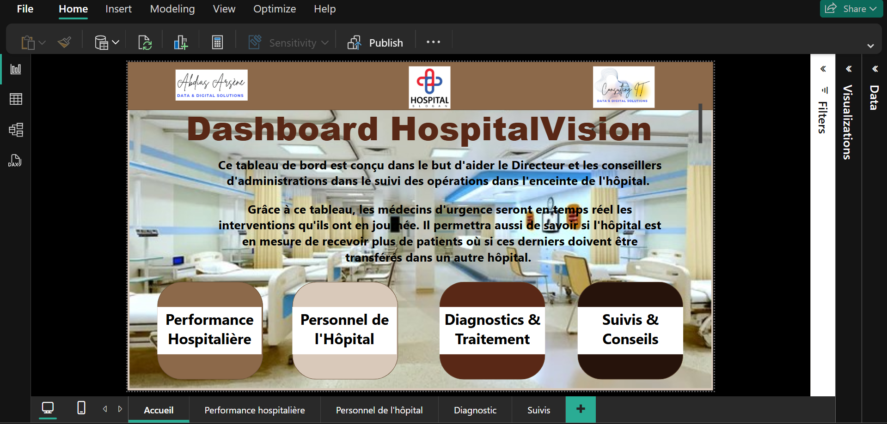
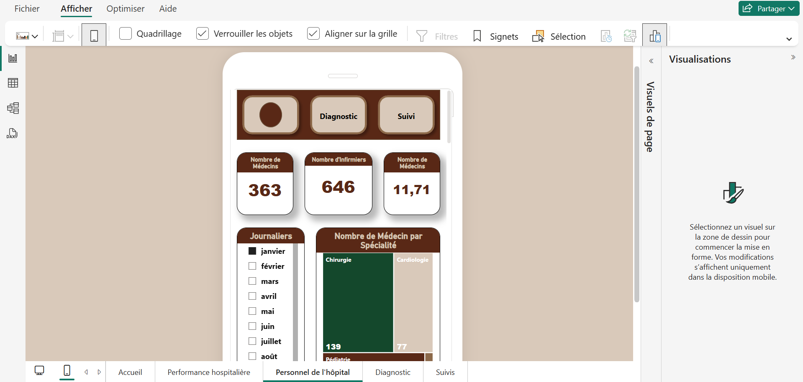
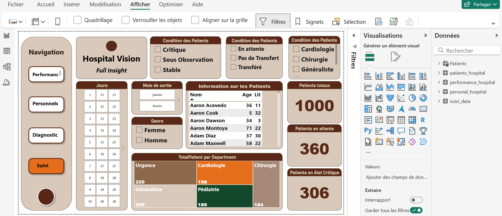
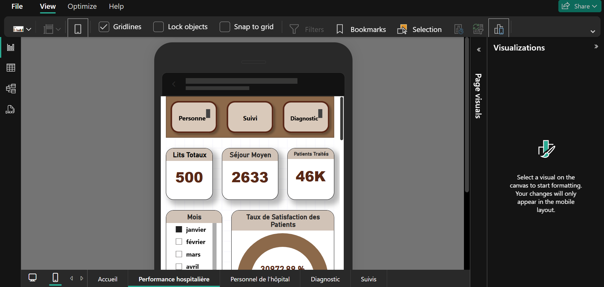

# 🏥 Tableau de Bord Interactif pour la Performance Hospitalière et des Patients

## 🎯 Objectifs du Projet

L'objectif de ce projet est de développer un **tableau de bord interactif** destiné à :

- 📈 **Suivre les performances hospitalières** (taux d'occupation, durée moyenne de séjour, gestion des lits).
- 🧑‍⚕️ **Surveiller l'état des patients** (suivi des signes vitaux, diagnostics).
- 🦠 **Analyser les données épidémiologiques** (propagation des maladies, vaccination, etc.).


---

## 🛠 Technologies et Outils

- **Langages de programmation** : Python, SQL
- **Outils de visualisation** : Power BI, Tableau, Matplotlib
- **Systèmes de gestion de bases de données** : MySQL, PostgreSQL

---

## 🖥 Conception du Tableau de Bord

Le tableau de bord est structuré en trois grandes sections :

### 1. Suivi des Performances Hospitalières
- **Indicateurs Clés** :
  - Taux d'occupation
  - Durée moyenne de séjour
  - Gestion des lits
- **Visualisations** :
  - Diagrammes en barres
  - Graphiques en ligne
  - Cartes thermiques
- **Filtres** :
  - Par service hospitalier
  - Par période
  - Par type de soin



---

### 2. Surveillance des Patients
- **Indicateurs Clés** :
  - Fréquence cardiaque
  - Température corporelle
  - Diagnostic médical
- **Visualisations** :
  - Courbes de suivi
  - Tableaux de bord dynamiques
- **Filtres** :
  - Par patient
  - Par pathologie
  - Par unité de soin

---

## 🛤 Étapes du Projet

| Phase | Description |
|:-----:|:------------|
| **Planification** | Définir les objectifs du projet, les indicateurs clés et les besoins en données. |
| **Conception** | Structurer la base de données et concevoir les maquettes du tableau de bord. |
| **Développement** | Construire la base de données et réaliser les visualisations. |
| **Tests et Validation** | Tester les fonctionnalités du tableau de bord et valider la qualité des données. |
| **Déploiement et Formation** | Déployer la solution et former les utilisateurs à son utilisation. |


---

## 📂 Structure du Dépôt

```plaintext
healthcare-dashboard/
├── dashboard/
│   └── powerbi_dashboard.pbix
├── scripts/
│   ├── data_processing.py
│   └── data_visualization.py
└── README.md
```

---

## 📧 Contact

Pour toute question, suggestion ou retour, n'hésitez pas à me contacter :

- **Abdias Arsène** | Consultant IT en Technologies Innovantes  
- **Email** : abdiasarsene@gmail.com  
- **LinkedIn** : [Abdias Arsène. Z 📊](https://linkedin.com/in/your-profile)

---

Veux-tu aussi que je prépare une **autre variante** encore plus "moderne" avec des emojis supplémentaires pour dynamiser encore plus ton README ? 🚀 (ça peut donner un style visuel plus engageant si tu le souhaites !)
